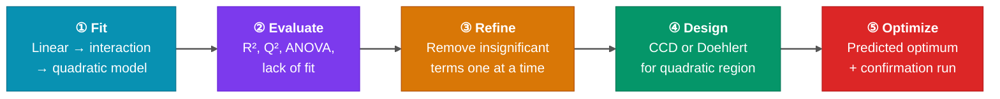
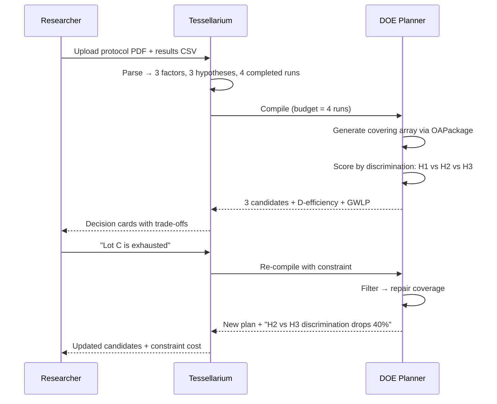
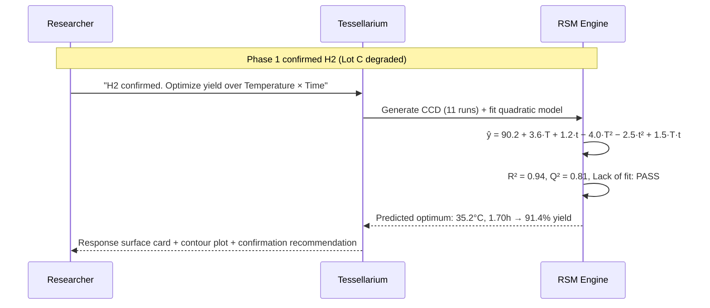

<!-- Badges -->
[](https://www.python.org/)
[](https://fastapi.tiangolo.com/)
[](https://docs.pydantic.dev/)
[](https://pypi.org/project/pyDOE2/)
[](https://oapackage.readthedocs.io/)
[](https://leanprover.github.io/)

[](https://learn.microsoft.com/en-us/azure/azure-resource-manager/bicep/)
[](https://azure.microsoft.com/)
[](#acknowledgments)
[](LICENSE)

### Decisive Experiment Compiler

> *Unbiased experimental mosaics, by design.*

---

## The problem

A researcher has competing hypotheses, partial data — protocols in PDF, results in CSV, images from assays — real-world constraints such as limited budgets, depleted materials, and safety-sensitive domains, and one urgent question: **what experiment should I run next?**

Today, the answer comes from intuition, conversations with colleagues, or a language model that generates plausible text without formal guarantees. None of these sources compute which experiment is optimal, what combinatorial coverage it achieves, which hypotheses it can and cannot discriminate, or what the researcher loses if a constraint prevents it from being executed.

Existing DOE software — JMP, Minitab, Design-Expert — computes designs correctly once the researcher has already identified the important factors, chosen a design family, and specified the domain. But that presupposes the researcher already knows *what* to optimize. When she arrives with competing hypotheses and partial data, no existing tool answers the prior question: which experiments would discriminate between her explanations?

Conversely, AI-powered scientific assistants — Google AI co-scientist, Microsoft Discovery, Sapio ELaiN, Labguru — interpret protocols and suggest next steps as free text. None of them formulates the next experiment as an optimization problem with verifiable properties, and none transitions from hypothesis discrimination to formal response surface optimization.

---

## The goal

Tessellarium treats experimental design as a **two-phase compiled workflow**.

**Phase 1 — Hypothesis Discrimination.** Given competing hypotheses, partial evidence, material and safety constraints, and a fixed run budget, it computes the minimal experimental matrix that maximizes hypothesis discrimination using covering arrays, orthogonal arrays, and fractional factorials. Its output is a concrete experimental artifact: the design matrix, the discrimination score per hypothesis pair, the pairwise coverage map, and the explicit cost of each constraint in terms of lost discrimination capability.

**Phase 2 — Response Surface Optimization.** Once discrimination narrows the hypotheses, Tessellarium transitions to classical response surface methodology. It fits polynomial models (linear, interaction, quadratic) to accumulated response data, evaluates model quality (R², Q², ANOVA, lack of fit), generates Central Composite or Doehlert designs, and estimates the optimal operating conditions with confidence intervals and a contour map.

This is the sequential workflow Fisher prescribed — screen first, optimize second — but with the hypothesis discrimination layer that was always missing.

---

## Theoretical foundation

The system is grounded in Fisher's theory of experimental design and in the classical DOE methodology formalized by Lundstedt et al. (1998). Experiments progress through two phases: **discrimination** (which explanation is correct?) and **optimization** (where is the best operating point?). Each phase uses different mathematical machinery.

**Phase 1 — Discrimination Pipeline**

The core engine follows a five-stage pipeline — **Generate → Filter → Score → Repair → Assess** — that separates mathematical design construction from hypothesis-specific optimization:


Design generation uses two specialized libraries — **OAPackage** for orthogonal array enumeration, D-optimal design synthesis, and statistical quality assessment; and **PyDOE2** for generalized subset designs and fractional factorials — with greedy set cover as the universal fallback. Discrimination scoring against hypothesis pairs is Tessellarium's unique contribution: no classical DOE library optimizes for this.

**Phase 2 — Response Surface Optimization Pipeline**

Once hypotheses are resolved, the system transitions to classical response surface methodology following the Lundstedt et al. workflow:



The transition between phases is triggered when discrimination resolves the competing hypotheses. At that point, the system fits a polynomial response model to the accumulated data, evaluates model adequacy using the diagnostics Lundstedt et al. prescribe (R² ≥ 0.8, Q² ≥ 0.5 for chemical data, no significant lack of fit), and switches to CCD or Doehlert designs for quadratic optimization. Center points are included automatically for continuous factors to detect curvature.

---

## How it works

```mermaid
flowchart TB
    subgraph S1["<b>1 — Multimodal Ingestion</b>"]
        PDF["📄 Protocol PDF"]
        CSV["📊 Results CSV"]
        IMG["🖼️ Assay Image"]
        CU["Azure Content<br/>Understanding"]
        PDF --> CU
    end

    subgraph S2["<b>2 — Problem Space Construction</b>"]
        PA["<b>Parser Agent</b><br/>GPT-4o"]
        PS[("<b>Problem Space</b><br/>Factors · Hypotheses<br/>Evidence · Constraints<br/>Completed runs")]
        CU --> PA
        CSV --> PA
        IMG -.->|"planned"| PA
        PA --> PS
    end

    subgraph S3["<b>3 — Safety Gate</b>"]
        SG["<b>Safety Governor</b><br/>Deterministic rules<br/>+ Content Safety API"]
        PS --> SG
        SG -->|"ALLOW ✓"| DOE
        SG -->|"DEGRADE ⚠️"| DOE
        SG -->|"BLOCK 🛑"| Block["Evidence summary<br/>+ mandatory human review"]
    end

    subgraph S4["<b>4 — Deterministic Compilation</b>"]
        DOE["<b>DOE Planner</b><br/>Pure Python · Zero LLM"]
        OA["OAPackage"]
        PD["PyDOE2"]
        GR["Greedy"]
        DOE --> OA & PD & GR
        OA & PD & GR --> C1["<b>Candidate 1</b><br/>Max Discrimination"]
        OA & PD & GR --> C2["<b>Candidate 2</b><br/>Max Robustness"]
        OA & PD & GR --> C3["<b>Candidate 3</b><br/>Max Coverage"]
    end

    subgraph S5["<b>5 — Critique & Explanation</b>"]
        CR["<b>Critic Agent</b><br/>GPT-4o-mini"]
        EX["<b>Explainer Agent</b><br/>GPT-4o"]
        DC["<b>Decision Cards</b><br/>6-field structured<br/>explanation per candidate"]
        C1 & C2 & C3 --> CR --> EX --> DC
        EX -.-> SR["AI Search<br/>Grounding citations"]
    end

    subgraph S6["<b>6 — Optional Verification</b>"]
        LN["<b>Lean 4</b><br/>Formal proof of<br/>design properties"]
        C1 & C2 & C3 -.-> LN
    end

    subgraph S7["<b>7 — Response Surface Optimization</b>"]
        FIT["<b>Model Fitting</b><br/>Linear → Interaction<br/>→ Quadratic"]
        EVAL["<b>Model Evaluation</b><br/>R², Q², ANOVA<br/>Lack of fit"]
        RSMX["<b>RSM Design</b><br/>CCD / Doehlert"]
        OPTX["<b>Predicted Optimum</b><br/>+ Confirmation run"]
        FIT --> EVAL --> RSMX --> OPTX
    end

    DC --> OUT["<b>Output:</b> 3 candidates + design matrices + decision cards<br/>+ coverage map + discrimination metrics + constraint costs"]
    OUT --> RUN["🔬 <b>Researcher</b><br/>Runs experiments<br/>Collects response data"]
    RUN -->|"hypotheses resolved"| FIT

    style S1 fill:#263238,stroke:#546e7a,color:#eceff1
    style S2 fill:#1a237e,stroke:#3949ab,color:#e8eaf6
    style S3 fill:#e65100,stroke:#f57c00,color:#fff3e0
    style S4 fill:#1b5e20,stroke:#388e3c,color:#e8f5e9
    style S5 fill:#283593,stroke:#3f51b5,color:#e8eaf6
    style S6 fill:#4a148c,stroke:#7b1fa2,color:#f3e5f5
    style S7 fill:#164e63,stroke:#0891b2,color:#ecfeff

    style PDF fill:#37474f,stroke:#78909c,color:#eceff1
    style CSV fill:#37474f,stroke:#78909c,color:#eceff1
    style IMG fill:#37474f,stroke:#78909c,color:#eceff1
    style CU fill:#0d47a1,stroke:#1565c0,color:#ffffff

    style PA fill:#1a237e,stroke:#3949ab,color:#ffffff
    style PS fill:#0d47a1,stroke:#1976d2,color:#ffffff

    style SG fill:#bf360c,stroke:#e64a19,color:#ffffff
    style Block fill:#b71c1c,stroke:#c62828,color:#ffffff

    style DOE fill:#1b5e20,stroke:#2e7d32,color:#ffffff
    style OA fill:#2e7d32,stroke:#43a047,color:#ffffff
    style PD fill:#2e7d32,stroke:#43a047,color:#ffffff
    style GR fill:#2e7d32,stroke:#43a047,color:#ffffff
    style C1 fill:#004d40,stroke:#00796b,color:#ffffff
    style C2 fill:#004d40,stroke:#00796b,color:#ffffff
    style C3 fill:#004d40,stroke:#00796b,color:#ffffff

    style CR fill:#283593,stroke:#3f51b5,color:#ffffff
    style EX fill:#283593,stroke:#3f51b5,color:#ffffff
    style DC fill:#1a237e,stroke:#3949ab,color:#ffffff
    style SR fill:#4a148c,stroke:#7b1fa2,color:#ffffff

    style LN fill:#4a148c,stroke:#7b1fa2,color:#ffffff

    style FIT fill:#0e7490,stroke:#0891b2,color:#ffffff
    style EVAL fill:#6d28d9,stroke:#7c3aed,color:#ffffff
    style RSMX fill:#047857,stroke:#059669,color:#ffffff
    style OPTX fill:#b91c1c,stroke:#dc2626,color:#ffffff

    style OUT fill:#263238,stroke:#78909c,color:#ffffff
    style RUN fill:#4e342e,stroke:#8d6e63,color:#ffffff

    linkStyle default stroke:#90a4ae,stroke-width:1.5px
```



**1. Multimodal ingestion.**
The researcher uploads a protocol (PDF), experimental results (CSV), and optionally an assay image. Azure Content Understanding extracts document structure. Code Interpreter for CSV analysis and GPT-4o vision for image interpretation are planned for a future release.

**2. Problem space construction.**
A Parser Agent (GPT-4o) structures all extracted information into a unified representation: factors and their levels, competing hypotheses with epistemic and operative states, existing evidence, constraints, and already-tested combinations.

**3. Safety gate.**
A deterministic Safety Governor analyzes the problem space for clinically or biologically sensitive domains. Sensitive regions are excluded from the factor space *before* compilation — safety is a constraint on the input, not a filter on the output. The system reports what discrimination is lost by each exclusion.

**4. Deterministic compilation.**
The DOE Planner — pure Python, zero LLM — generates designs from known combinatorial families using OAPackage and PyDOE2, filters them against constraints, scores them by hypothesis discrimination, repairs coverage gaps, and assesses statistical quality. It produces three complementary candidates: one optimized for maximum discrimination, one for robustness and replication, and one for combinatorial coverage.

**5. Critique and explanation.**
A Critic Agent identifies weaknesses (confounding, coverage gaps, redundancy). An Explainer Agent generates a six-field decision card for each candidate: recommendation, rationale, evidence used, assumptions, limits, and what observation would change the recommendation — all grounded with citations from the Semantic Citation Layer.

**6. Optional verification.**
Design properties (pairwise coverage, Latin square bijectivity, BIBD balance) can be formally verified in Lean 4 via a dedicated verification service.

**7. Response surface optimization (Phase 2).**
When discrimination resolves the hypotheses, the researcher triggers Phase 2. The system fits polynomial models, evaluates quality against Lundstedt's criteria (R², Q², ANOVA, lack of fit), generates a CCD or Doehlert design, and presents the predicted optimum with a 3D response surface, contour plot, and coefficient chart in the optimization card. See the [Phase 2 pipeline](#theoretical-foundation) for the full five-stage flow.

---

## Key differentiators

**Compiler, not assistant.** The experiment design engine is deterministic code that generates designs from known combinatorial families, scores them by discrimination power, and computes quality metrics (D-efficiency, GWLP). In Phase 2, the compiler extends to polynomial model fitting, model evaluation (R², Q², ANOVA), and response surface optimization — all deterministic computation, no LLM. The LLM interprets inputs and explains outputs but never produces the experimental plan or the fitted model.

**Two-phase sequential workflow.** Tessellarium implements the screen→optimize sequence that classical DOE prescribes, but with hypothesis discrimination as the screening engine. Phase 1 answers "which explanation is correct?" Phase 2 answers "where is the optimum?" The transition is explicit and auditable.

**Mathematically grounded designs.** Candidates are generated from OAPackage (orthogonal arrays with proven strength-2 coverage, D-optimal designs via coordinate exchange) and PyDOE2 (fractional factorials, generalized subset designs, CCD), not from greedy heuristics alone. Every design carries its D-efficiency and generalized word-length pattern.

**Model quality gates.** Phase 2 evaluates every fitted model against Lundstedt's diagnostic criteria: explained variation (R²), predicted variation (Q²), ANOVA significance, and lack of fit. The system will not recommend an optimum from an inadequate model — it flags the gap and suggests additional runs or model terms.

**Constraint-aware compilation.** Safety exclusions, material constraints, and budget limits are enforced *before* the planner runs — safety is a constraint on the input, not a filter on the output. Each compilation cycle produces three candidates (discrimination, robustness, coverage), and every restriction is quantified: the researcher sees exactly what hypothesis pairs become indistinguishable and why.

---

## Combinatorial design families

Tessellarium selects from established design families based on the problem structure and the experimental phase. Each family has different strengths. The intuition behind the most important ones:

### Orthogonal arrays

**The idea:** every pair of factors is tested in every combination of their levels, even though you don't test all possible runs.

**Analogy:** Imagine you're testing 4 pizza recipes varying crust (thin/thick), sauce (red/white), and cheese (mozzarella/cheddar). A full test is 2×2×2 = 8 pizzas. An orthogonal array of 4 runs lets you taste just 4 pizzas, yet for *every pair* of factors, you've tried all four combinations. You can cleanly separate "is it the crust or the sauce?" — the effects are not confounded.

```
Run  Crust  Sauce  Cheese
 1   Thin   Red    Mozzarella
 2   Thin   White  Cheddar
 3   Thick  Red    Cheddar
 4   Thick  White  Mozzarella
```

Check: Crust × Sauce? Thin-Red ✓, Thin-White ✓, Thick-Red ✓, Thick-White ✓. All four pairs appear. Same for every other pair of columns. That's strength-2 orthogonality — the defining property. Tessellarium uses **OAPackage** to enumerate these arrays and select the one with the best D-efficiency.

### Covering arrays

**The idea:** guarantee that every t-way combination of factor levels appears *at least once*, even under constraints.

**Analogy:** You're testing a web form with 5 fields, each with 3 options. A full test is 3⁵ = 243 configurations. A strength-2 covering array might need only 15 — every pair of fields still sees all 9 combinations. If a bug requires two specific settings to trigger, you'll find it.

Unlike orthogonal arrays, covering arrays allow *imbalanced* replication — some combinations may appear more than once. This flexibility is what makes them work when constraints exclude certain combinations. Tessellarium uses covering arrays as the default in Phase 1 when constraints invalidate pure orthogonal designs.

### Fractional factorials

**The idea:** run a mathematically chosen *fraction* of the full factorial, trading higher-order interactions you don't care about for fewer runs.

**Analogy:** You have 6 binary factors (on/off each). Full factorial: 2⁶ = 64 runs. A 2⁶⁻² fractional factorial: 16 runs. You can estimate all 6 main effects and many 2-factor interactions, but some 2-factor interactions are "aliased" with each other — you can't tell them apart. The aliasing structure is known in advance, so the researcher chooses the resolution that matches their priorities.

```
Resolution III:  Main effects estimable, but aliased with 2-factor interactions.
Resolution IV:   Main effects clean; 2-factor interactions aliased with each other.
Resolution V:    Main effects and 2-factor interactions all estimable.
```

Tessellarium uses **PyDOE2** for these when all factors have the same number of levels.

### Latin squares

**The idea:** arrange treatments in a grid where each treatment appears exactly once per row and once per column, blocking two sources of nuisance variation simultaneously.

**Analogy:** A hospital tests 4 drugs across 4 wards (rows) and 4 time periods (columns). Each drug appears in every ward and every period exactly once. Ward-to-ward variation and period-to-period variation are both blocked — the drug effect is estimated cleanly.

```
          Period 1  Period 2  Period 3  Period 4
Ward A       D₁        D₂        D₃        D₄
Ward B       D₂        D₃        D₄        D₁
Ward C       D₃        D₄        D₁        D₂
Ward D       D₄        D₁        D₂        D₃
```

### BIBDs (Balanced Incomplete Block Designs)

**The idea:** when blocks are too small to hold all treatments, arrange them so every pair of treatments appears together in the same number of blocks.

**Analogy:** A wine tasting with 7 wines, but each taster can only try 3 per session. A BIBD arranges the sessions so every pair of wines is compared by the same number of tasters — no pair has an unfair advantage.

```
Session 1: Wine A, Wine B, Wine D
Session 2: Wine B, Wine C, Wine E
Session 3: Wine C, Wine D, Wine F
Session 4: Wine D, Wine E, Wine G
Session 5: Wine E, Wine F, Wine A
Session 6: Wine F, Wine G, Wine B
Session 7: Wine G, Wine A, Wine C
```

Every pair of wines appears together in exactly 1 session. That's the *balance* property — λ = 1.

### D-optimal designs

**The idea:** when no standard family fits (non-standard run sizes, irregular constraints), use numerical optimization to find the design that maximizes the determinant of the information matrix — the design that gives the smallest confidence regions for the estimated effects.

Tessellarium uses **OAPackage's coordinate-exchange algorithm** (`Doptimize`) to generate these. The optimization function is configurable: α=[1,2,0] prioritizes main-effect robustness (for MAX_ROBUSTNESS candidates); α=[1,0,0] targets pure D-efficiency (for MAX_COVERAGE candidates).

### Central Composite Designs (CCD)

**The idea:** augment a factorial design with axial (star) points and center points to fit a full quadratic model — enabling estimation of curvature and prediction of an optimum.

**Structure:** A CCD for k factors consists of: (1) a 2ᵏ or fractional factorial (the cube points), (2) 2k axial points at distance ±α from the center along each axis, and (3) nᶜ center-point replicates.

**Analogy:** You've already tested the corners of a square (factorial). The CCD adds points along the axes beyond the square (to measure curvature) and points at the center (to estimate pure error and detect nonlinearity). With 2 factors, that's 4 corners + 4 star points + 3 center points = 11 runs for a full quadratic model.

Tessellarium generates CCDs in Phase 2 for fitting full quadratic models. Center-point deviation or significant lack of fit in the linear model signals when a quadratic design is needed.

### Doehlert designs

**The idea:** place experimental points on a uniform shell (hexagonal pattern in 2D) around a suspected optimum, allowing efficient estimation of a quadratic response surface with fewer runs than a CCD.

**Structure:** For 2 factors, a Doehlert design has 7 points: 1 center + 6 forming a regular hexagon. For 3 factors, 13 points form a cuboctahedron. The key advantage: neighboring domains can be explored by adding only a few new runs — the existing hexagon shares edges with adjacent hexagons.

**Analogy:** Imagine placing sensors on a honeycomb grid to map temperature across a surface. Each hexagonal cell shares its boundary with the next, so extending your map to a new region reuses the sensors already on the shared edge. You cover more territory per sensor than with a square grid.

Tessellarium uses Doehlert designs in Phase 2 as an alternative to CCD when the experimenter wants maximum efficiency per run or plans to explore adjacent regions sequentially.

### Mixture designs

**The idea:** when experimental factors are proportions of a formulation that must sum to a constant (100%), ordinary factorial designs produce invalid combinations. Mixture designs respect the constant-sum constraint.

**Analogy:** You're developing a concrete mix with cement, sand, and water. You can't independently set cement=80%, sand=80%, water=80% — they must sum to 100%. The experimental region is a triangle (simplex), not a cube. A mixture design places runs on and inside this triangle.

**Key distinction:** Mixture factors are coupled by the constant-sum constraint and cannot vary independently. Tessellarium detects mixture factors from the ProblemSpace, applies pseudo-component transformations when the feasible region is a sub-simplex, and uses D-optimal designs for irregular constrained regions, following Lundstedt et al.'s recommendation.

---

## Applied examples

### Pharmaceutical process optimization

In pharmaceutical development, Design of Experiments (DoE) is a standard methodology for reaction optimization under Quality by Design (QbD) frameworks. A typical process with multiple factors requires a sequential workflow — scoping, screening, RSM optimization, robustness — consuming 30–40 experiments across weeks.

Tessellarium compresses this workflow. Consider a reagent stability assay where yields are dropping. The researcher has 3 factors (Temperature, Reagent Lot, Incubation Time), 3 competing hypotheses about the root cause, 4 completed runs, and a budget of 4 more runs. When a reagent (Lot C) becomes unavailable mid-study, the system recalculates and quantifies the discrimination lost.

**Phase 1 — Discrimination**



**Phase 2 — Response Surface Optimization**



### Agronomic field trials

A 7×7 field trial with two blocking factors (soil moisture gradient, sun exposure gradient), two treatment factors (7 fertilizer formulations, 7 irrigation levels), and spatial constraints (equipment failure in column 4, safety exclusion of fertilizer G near a watercourse) requires a pair of Mutually Orthogonal Latin Squares (MOLS) that respect all exclusions.

Tessellarium constructs the design, applies constraint exclusions, and reports: "Without irrigation levels R5–R7 in column 4, the interaction fertilizer×irrigation in the central zone cannot be fully characterized. Discrimination between H2 (irrigation insufficient) and H3 (interaction effect) drops 14%."

---

## Architecture

The system separates three types of reasoning following the same neurosymbolic principle recently validated for mathematical discovery in combinatorial design theory *(Xia et al., 2026)*:

> The LLM interprets and explains.
> Deterministic code computes and optimizes.
> The researcher directs and decides.


### Azure services

| Service | Role |
|---|---|
| **Foundry Agent Service** | Agent orchestration (Parser, Critic, Explainer) — optional, falls back to direct Azure OpenAI |
| **Azure OpenAI** (GPT-4o, GPT-4o-mini) | Interpretation, explanation, vision |
| **Azure Content Understanding** | PDF protocol ingestion |
| **Azure AI Content Safety** | Prompt Shields, domain-specific categories |
| **Azure AI Search** | Hybrid search for grounded citations |
| **Cosmos DB** | Session persistence |
| **Container Apps** | Backend hosting (API + worker + Lean verifier) |
| **Static Web Apps** | Frontend hosting |
| **Front Door Premium + WAF** | CDN, TLS termination, bot protection |
| **Lean 4** *(optional)* | Formal verification of design properties |

### DOE computation libraries

| Library | Role |
|---|---|
| **OAPackage** | Orthogonal array enumeration, D-optimal design synthesis, quality metrics (D-efficiency, GWLP, rank) |
| **PyDOE2** | Generalized subset designs (mixed-level fractional factorials), 2-level fractional factorials, full factorials, CCD and Doehlert design generation |
| **NumPy / SciPy** | Polynomial model fitting (least squares), ANOVA (F-tests), cross-validation (Q²/PRESS), optimum estimation (constrained minimization) |
| **Greedy set cover** | Greedy selection with hypothesis-discrimination scoring — the scoring function is Tessellarium's unique contribution |

The result is an auditable experimental artifact with traceable justification at every step, from ingestion to compilation to verification to optimization.

---

## Quick start

### Prerequisites

- Python 3.12+
- Node.js 20+
- Azure CLI (`az`) and Azure Developer CLI (`azd`)
- An Azure subscription with Azure OpenAI access

### Local development

```bash
# Clone the repository
git clone https://github.com/Tessellarium/tessellarium.git
cd tessellarium

# Backend
cd backend
cp .env.template .env          # Edit with your Azure credentials (optional for tests)
pip install -r requirements.txt
uvicorn main:app --reload --port 8000

# Frontend (in a separate terminal)
cd frontend
npm install
npm run dev
```

### Run the integration test (no Azure credentials needed)

```bash
cd backend
python tests/test_doe_planner.py
```

This test simulates the full pipeline: a reagent stability assay with 3 factors, 3 hypotheses, 4 completed runs, a budget of 4 more runs, constraint addition ("Lot C exhausted"), recalculation with discrimination cost, and a clinical safety block. All components are deterministic — no API calls required.

### Run the full test suite

```bash
cd backend
python -m pytest tests/ -v

# Or run individual test files:
python tests/test_doe_planner.py          # Core DOE compilation + constraints
python tests/test_design_generators.py    # Classical design generation (OAPackage + PyDOE2)
python tests/test_rsm_fitter.py           # Polynomial fitting + model diagnostics
python tests/test_ccd_generator.py        # CCD construction + center points
python tests/test_safety_governor.py      # Safety checks (ALLOW / DEGRADE / BLOCK)
python tests/test_critic_agent.py         # Offline critique logic
python tests/test_explainer_agent.py      # Decision card generation
python tests/test_search_service.py       # Semantic Citation Layer chunk extraction
python tests/test_content_understanding.py # PDF parsing
python tests/test_cosmos_store.py         # Serialization roundtrip
python tests/test_api_integration.py      # FastAPI endpoint tests
```

### Deploy to Azure

```bash
azd auth login
azd init
azd up
```

This provisions all Azure resources via Bicep (OpenAI, Content Safety, AI Search, Cosmos DB, Container Apps, Static Web Apps, Front Door + WAF) and deploys the backend and frontend.

---

## Project structure

```
tessellarium/
│
├── .gitignore
├── azure.yaml                          # azd manifest
├── LICENSE                             # MIT
├── README.md
│
├── .devcontainer/
│   └── devcontainer.json               # Dev container (Python 3.12, Node 20, az/azd CLI)
│
├── .vscode/
│   ├── settings.json                   # Workspace settings
│   └── launch.json                     # Debug configurations
│
├── infra/                              # Infrastructure as Code
│   ├── main.bicep                      # Orchestrator (subscription-scoped)
│   ├── main.parameters.json            # Environment parameters
│   ├── abbreviations.json              # Resource naming conventions
│   └── modules/
│       ├── openai.bicep                # Azure OpenAI (GPT-4o, GPT-4o-mini, GPT-4.1, embeddings)
│       ├── content-safety.bicep        # Azure AI Content Safety
│       ├── search.bicep                # Azure AI Search (semantic enabled)
│       ├── cosmos.bicep                # Cosmos DB serverless (sessions, threads, compilations)
│       ├── storage.bicep               # Azure Blob Storage (uploads, processed, literature)
│       ├── container-apps.bicep        # Container Apps (API + worker + Lean verifier)
│       ├── static-web-app.bicep        # Static Web App (React frontend)
│       ├── acr.bicep                   # Azure Container Registry
│       ├── network.bicep               # VNet + private DNS zones
│       ├── identity.bicep              # Managed identities + RBAC
│       ├── agent-stores.bicep          # Foundry agent-dedicated stores
│       ├── foundry.bicep               # Foundry Hub + Project
│       ├── front-door.bicep            # Front Door Premium + WAF
│       └── private-endpoint.bicep      # Reusable PE module
│
├── backend/
│   ├── Dockerfile
│   ├── requirements.txt
│   ├── .env.template
│   ├── main.py                         # FastAPI orchestrator
│   ├── config/
│   │   └── settings.py                 # Azure configuration (pydantic-settings)
│   ├── app/
│   │   ├── models/
│   │   │   ├── problem_space.py        # Central data schema (ProblemSpace, all types)
│   │   │   ├── response_model.py       # FittedModel, CoefficientEstimate, ModelQuality
│   │   │   └── experimental_phase.py   # ExperimentalPhase enum (DISCRIMINATION, OPTIMIZATION)
│   │   ├── doe_planner/
│   │   │   ├── planner.py              # Deterministic compiler (5-stage pipeline)
│   │   │   └── design_generators.py    # OAPackage + PyDOE2 generator hierarchy
│   │   ├── rsm/
│   │   │   ├── model_fitter.py         # Polynomial fitting (linear → quadratic)
│   │   │   ├── model_evaluator.py      # R², Q², ANOVA, lack of fit
│   │   │   ├── optimizer.py            # Predicted optimum + confidence region
│   │   │   └── ccd_generator.py        # CCD and Doehlert design construction
│   │   ├── safety/
│   │   │   └── governor.py             # Deterministic policy engine
│   │   ├── agents/
│   │   │   ├── foundry_client.py       # Azure Foundry / direct OpenAI client
│   │   │   ├── parser_agent.py         # GPT-4o structured extraction
│   │   │   ├── critic_agent.py         # Design weakness analysis
│   │   │   └── explainer_agent.py      # Decision card generation
│   │   └── services/
│   │       ├── content_understanding.py # PDF protocol ingestion
│   │       ├── content_safety_service.py # Text moderation + Prompt Shields
│   │       ├── cosmos_store.py          # Session persistence
│   │       └── search_service.py        # Semantic Citation Layer
│   └── tests/
│       ├── test_doe_planner.py          # Core integration test
│       ├── test_design_generators.py    # Classical design generation
│       ├── test_rsm_fitter.py           # Polynomial fitting + diagnostics
│       ├── test_ccd_generator.py        # CCD construction + center points
│       ├── test_safety_governor.py      # Safety checks
│       ├── test_critic_agent.py         # Critic offline logic
│       ├── test_explainer_agent.py      # Explainer offline logic
│       ├── test_search_service.py       # Chunk extraction
│       ├── test_content_understanding.py # PDF parsing
│       ├── test_cosmos_store.py         # Serialization
│       └── test_api_integration.py      # API endpoints
│
├── frontend/
│   ├── package.json
│   ├── vite.config.ts
│   ├── tailwind.config.js
│   ├── tsconfig.json
│   ├── index.html
│   └── src/
│       ├── main.tsx
│       ├── App.tsx
│       ├── api/client.ts               # Axios API client
│       ├── types/index.ts              # TypeScript interfaces
│       ├── components/
│       │   ├── CandidateCard.tsx        # Phase 1 design candidate display
│       │   ├── DesignMatrixTable.tsx    # Matrix visualization
│       │   ├── DecisionCardView.tsx     # 6-field decision card
│       │   ├── VerificationBadge.tsx    # Lean verification status
│       │   ├── ResponseSurfaceCard.tsx  # Phase 2 card (model eq, R²/Q², contour, optimum)
│       │   ├── ContourPlot.tsx          # 2D contour visualization
│       │   ├── SurfacePlot3D.tsx        # 3D response surface (Three.js or Plotly)
│       │   ├── CoefficientChart.tsx     # Horizontal bar chart with CI whiskers
│       │   └── ErrorBoundary.tsx        # React error boundary
│       └── pages/
│           ├── Home.tsx
│           ├── Upload.tsx               # File + text upload
│           ├── Session.tsx              # Compilation + constraints
│           └── Sessions.tsx             # Session list
│
├── lean-verify/                        # Lean 4 verification service
│   ├── Dockerfile                      # Ubuntu + elan + Lean 4
│   ├── requirements.txt
│   ├── main.py                         # FastAPI (port 8001)
│   ├── app/
│   │   ├── models.py                   # VerificationRequest/Response
│   │   ├── verifier.py                 # Generate .lean → lake build → parse
│   │   └── lean_generator.py           # Jinja2 → Lean 4 code
│   ├── lean_templates/
│   │   ├── covering_array.lean.j2      # Pairwise coverage proof
│   │   ├── latin_square.lean.j2        # Bijectivity proof
│   │   └── bibd.lean.j2               # Balance proof (placeholder)
│   └── tests/
│       └── test_lean_generator.py
│
├── lean/                               # Lean 4 library (stretch goal)
│   └── Tessellarium/
│       ├── lakefile.lean
│       ├── lean-toolchain
│       └── Tessellarium/
│           ├── Basic.lean
│           └── CoveringArray.lean
│
├── docs/
│   ├── images/
│   ├── architecture/
│   │   └── data-flow.md
│   └── roadmap/
│       ├── semantic-citation-layer.md
│       └── neurosymbolic-discovery.md
│
├── demo/
│   ├── reagent-stability-assay.json
│   ├── protocol-sample.pdf
│   └── results-sample.csv
│
└── scripts/
    ├── deploy.sh
    ├── build-backend.sh
    └── run-local.sh
```

---

## API endpoints

| Method | Route | Description |
|---|---|---|
| `GET` | `/health` | Health check |
| `POST` | `/api/upload` | Upload files (PDF, CSV, image) → parse → ProblemSpace |
| `POST` | `/api/parse` | Raw text → Parser Agent → ProblemSpace |
| `POST` | `/api/problem-space/{id}` | Load ProblemSpace directly (testing) |
| `POST` | `/api/compile` | Safety → DOE Planner → 3 candidates |
| `POST` | `/api/constrain/{id}` | Add constraint → recalculate → show cost |
| `POST` | `/api/fit/{id}` | Fit polynomial model to completed runs → R², Q², coefficients |
| `POST` | `/api/optimize/{id}` | Generate RSM design (CCD/Doehlert) → predicted optimum |
| `GET` | `/api/surface/{id}` | Response surface data for 3D/contour visualization |
| `GET` | `/api/coverage/{id}` | Coverage map for visualization |
| `GET` | `/api/session/{id}` | Full ProblemSpace |
| `GET` | `/api/sessions` | List session summaries |
| `GET` | `/api/search?q={query}` | Search the Semantic Citation Layer |

---

## The compilation output

### Phase 1 — Hypothesis Discrimination

A chemist investigating a yield drop in her reagent stability assay uploads a protocol PDF and a CSV of results. Tessellarium parses the inputs and identifies:

- **3 factors:** Temperature (20°C, 30°C, 40°C), Reagent Lot (A, B, C), Incubation Time (1h, 2h)
- **3 hypotheses:** H1 — temperature drift causes the drop; H2 — lot C is degraded; H3 — incubation time is insufficient
- **4 runs already completed** (yielding 92%, 90%, 74%, 68%)
- **Budget:** 4 more runs
- **Constraint added mid-study:** "Lot C is exhausted" — no more reagent available

She clicks **Compile**. Tessellarium returns three candidates. Here is the first — optimized for maximum hypothesis discrimination:

<p align="center">
  
</p>

The card tells her exactly what she'll learn and what she won't. Temperature drift vs reagent degradation: fully distinguishable — the 4 runs contain every combination needed. Temperature drift vs insufficient time: only 50% distinguishable — the gaps at 20°C/2h and 30°C/1h are the missing pieces. The pairwise coverage heatmap makes this visible: green = covered, red = gap, grey = excluded by constraint. The constraint cost at the bottom: discrimination between H2 and H3 drops 40% because Lot C is gone.

She compares this with Candidate 2 (Max Robustness — D-optimal backbone with replication of the weakest pair) and Candidate 3 (Max Coverage — classical orthogonal array filling the most gaps), then chooses based on her current priority.

She runs the 4 experiments. Results confirm H2 — Lot C was degraded. H1 is ruled out.

### Phase 2 — Response Surface Optimization

With H2 confirmed, her question changes: given that Lot C is bad, what Temperature and Incubation Time maximize yield using Lots A and B?

Tessellarium transitions to Phase 2 and generates a Central Composite Design: 4 factorial corners, 4 axial points, 3 center replicates — 11 runs. After she completes them:

<p align="center">
  
</p>

The card shows a fitted quadratic model with color-coded coefficients on coded variables (magnitudes directly comparable). R² = 0.94 (the model explains 94% of variation), Q² = 0.81 (cross-validated prediction generalizes well), lack of fit: PASS. The 3D response surface and contour plot show the dome peaking at 35.2°C, 1.70h. The coefficient chart shows Temperature and T² curvature as the dominant significant effects. Predicted optimum: 91.4% yield with a 95% confidence interval.

The decision card recommends a single confirmation run at the predicted optimum. If the measured yield matches the prediction, the model is validated and she transitions to production monitoring. If it deviates significantly, the model needs additional terms or a smaller domain.

Phase 1 told her which explanation was correct. Phase 2 told her where the optimum lies. The full Fisher sequence — with the hypothesis stage that was always missing.

---

## Current limitations

### Implemented — Phase 1 (Discrimination)

- Covering array and orthogonal array generation via OAPackage
- Greedy hypothesis-discrimination-optimized design selection
- Pairwise coverage maps and constraint cost quantification
- Lean 4 formal verification (covering arrays, Latin squares)
- Safety Governor with ALLOW / DEGRADE / BLOCK
- Multimodal ingestion (PDF via Content Understanding)

### Implemented — Phase 2 (Optimization)

- Polynomial model fitting (linear, interaction, quadratic)
- Model evaluation: R², Q² (PRESS cross-validation), ANOVA, lack of fit
- Model refinement (one term at a time, monitoring Q² improvement)
- CCD and Doehlert design generation with center points
- Predicted optimum with confidence intervals
- Response surface visualization (3D surface, 2D contour, coefficient chart)

### Roadmap

- **Principled design family construction** — the Phase 1 planner currently uses greedy selection with post-hoc family labeling; algebraic construction with explicit generators and resolution for fractional factorials is planned
- **Automatic phase transition** — the switch from Phase 1 to Phase 2 is currently researcher-triggered; automatic transition based on model evaluation (e.g., linear model has significant lack of fit → suggest CCD) is planned
- **Mixture designs** — constant-sum constraints, pseudo-component transformations, D-optimal mixture designs
- **Effect-based hypothesis updating** — using fitted coefficient magnitudes to automatically update epistemic states (speculative → supported / challenged) when |bᵢ| exceeds significance thresholds
- **Normal probability plots** of effects for saturated screening designs
- **Code Interpreter** for CSV analysis (currently read as raw text)
- **GPT-4o vision** for image interpretation
- **MOLS algebraic construction** — planner uses OA/CA from OAPackage as substitute
- **BIBD verification** in Lean 4 (placeholder; covering array and Latin square verification are implemented)
- **Semantic Citation Layer** literature knowledge base (current grounding uses the researcher's own uploaded data)
- **Foundry Agent Service** integration (optional; falls back to direct Azure OpenAI calls)

---

## References

### Foundational theory

- Fisher, R.A. (1935). *The Design of Experiments*. Oliver & Boyd.
- Box, G.E.P., Hunter, J.S., & Hunter, W.G. (2005). *Statistics for Experimenters: Design, Innovation, and Discovery*. Wiley.
- Lundstedt, T., Seifert, E., Abramo, L., Thelin, B., Nyström, Å., Pettersen, J., & Bergman, R. (1998). *Experimental design and optimization*. Chemometrics and Intelligent Laboratory Systems, 42, 3–40.

### Combinatorial design

- Colbourn, C.J. & Dinitz, J.H. (2007). *Handbook of Combinatorial Designs*. CRC Press.
- Hedayat, A.S., Sloane, N.J.A., & Stufken, J. (1999). *Orthogonal Arrays: Theory and Applications*. Springer.
- Doehlert, D.H. (1970). *Uniform Shell Designs*. Journal of the Royal Statistical Society Series C, 19(3), 231–239.

### Neurosymbolic collaboration

- Xia, H., Gomes, C.P., Selman, B., & Szeider, S. (2026). *Agentic Neurosymbolic Collaboration for Mathematical Discovery: A Case Study in Combinatorial Design*. arXiv:2603.08322.
- Gomes, C.P. & Sellmann, M. (2004). *Streamlined Constraint Reasoning*. CP 2004, LNCS 3258, pp. 274–289.

### DOE computation libraries

- Eendebak, P.T. & Vazquez, A.R. (2019). *OApackage: A Python package for generation and analysis of orthogonal arrays, optimal designs and conference designs*. Journal of Open Source Software, 4(34), 1097.
- Schoen, E.D., Eendebak, P.T. & Nguyen, M.V.M. (2010). *Complete Enumeration of Pure-Level and Mixed-Level Orthogonal Arrays*. Journal of Combinatorial Designs, 18(2), 123–140.

### Knowledge graphs and semantic citation

- Nanopublication Guidelines. https://nanopub.net/guidelines/
- Wang, L. et al. (2025). *CE-KG: Citation-enhanced Knowledge Graph*. ISWC 2025.
- Semantic Scholar Open Data Platform. https://api.semanticscholar.org/

### DoE in industry

- Murray, P.M. et al. (2016). *The application of design of experiments (DoE) reaction optimization*. Org. Biomol. Chem., 14, 2373–2384.
- Weissman, S.A. & Anderson, N.G. (2015). *Design of Experiments (DoE) and Process Optimization*. Org. Process Res. Dev., 19(11), 1605–1633.

### Tools and frameworks

- Lean 4 Theorem Prover. https://leanprover.github.io/
- lean-lsp-mcp. Dressler, O. (2025). https://github.com/oOo0oOo/lean-lsp-mcp
- lean4-skills. Freer, C. (2025). https://github.com/cameronfreer/lean4-skills

---

## Acknowledgments

Tessellarium was developed as part of the Microsoft Innovation Challenge.

Built on Microsoft Azure services: Foundry Agent Service, Azure OpenAI, Azure Content Understanding, Azure AI Content Safety, Azure AI Search, Cosmos DB, Container Apps, Static Web Apps, and Front Door.

The theoretical foundation draws from R.A. Fisher's Design of Experiments tradition, from the classical DOE methodology of Lundstedt et al. (1998), and from the combinatorial design theory community. The neurosymbolic architecture is informed by recent work on agentic collaboration for mathematical discovery (Xia et al., 2026). Design generation leverages OAPackage (Eendebak & Vazquez, 2019) and PyDOE2. Response surface methodology follows the sequential workflow prescribed by Lundstedt et al.

Special thanks to the open-source communities behind Lean 4, Mathlib, OAPackage, PyDOE2, and the MCP ecosystem.

---

**License:** MIT

**Tagline:** *Unbiased experimental mosaics, by design.*